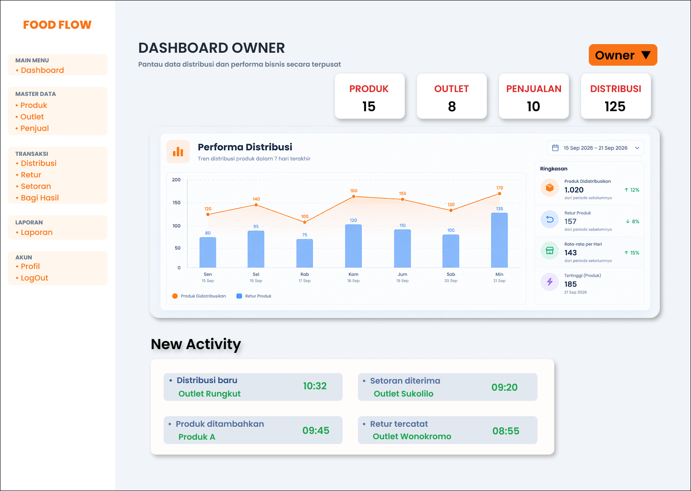
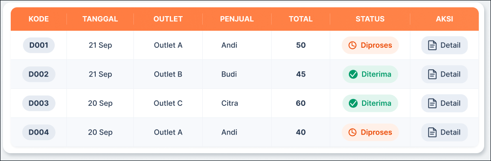
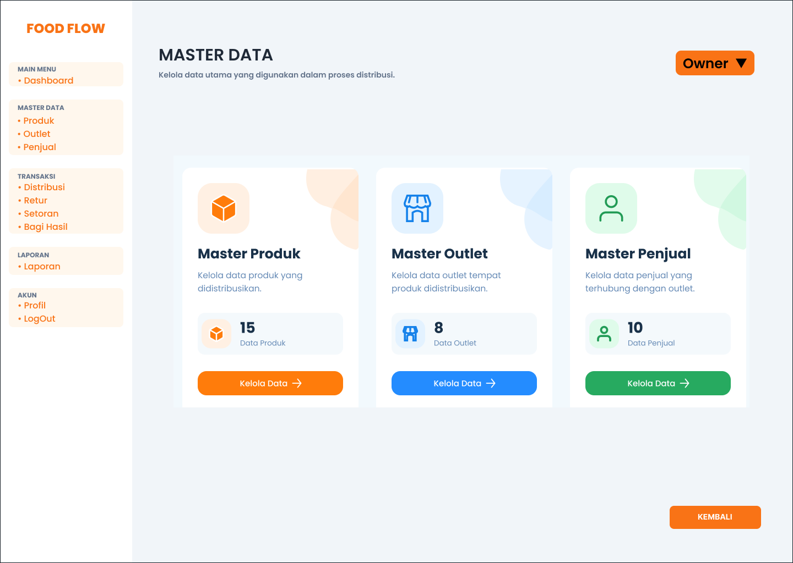
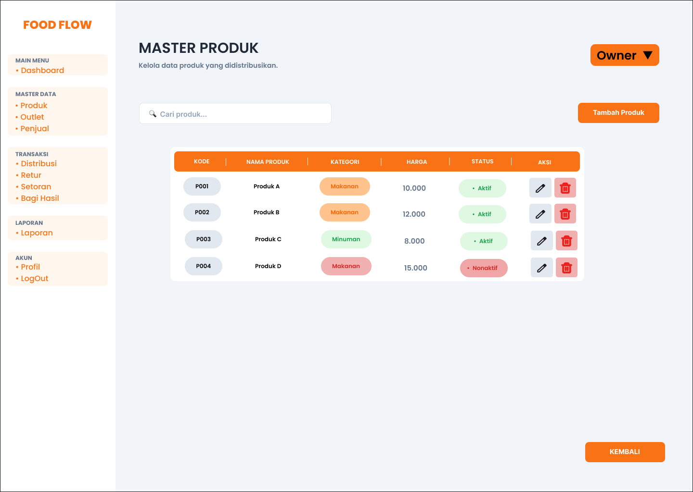
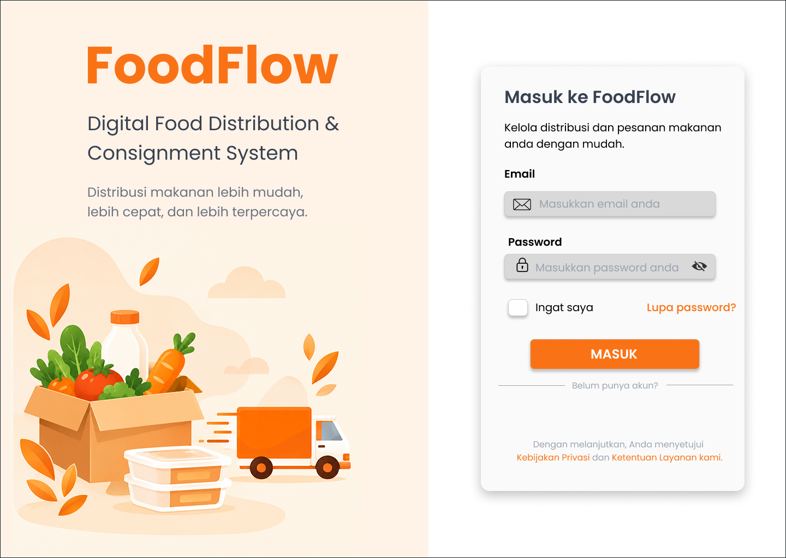
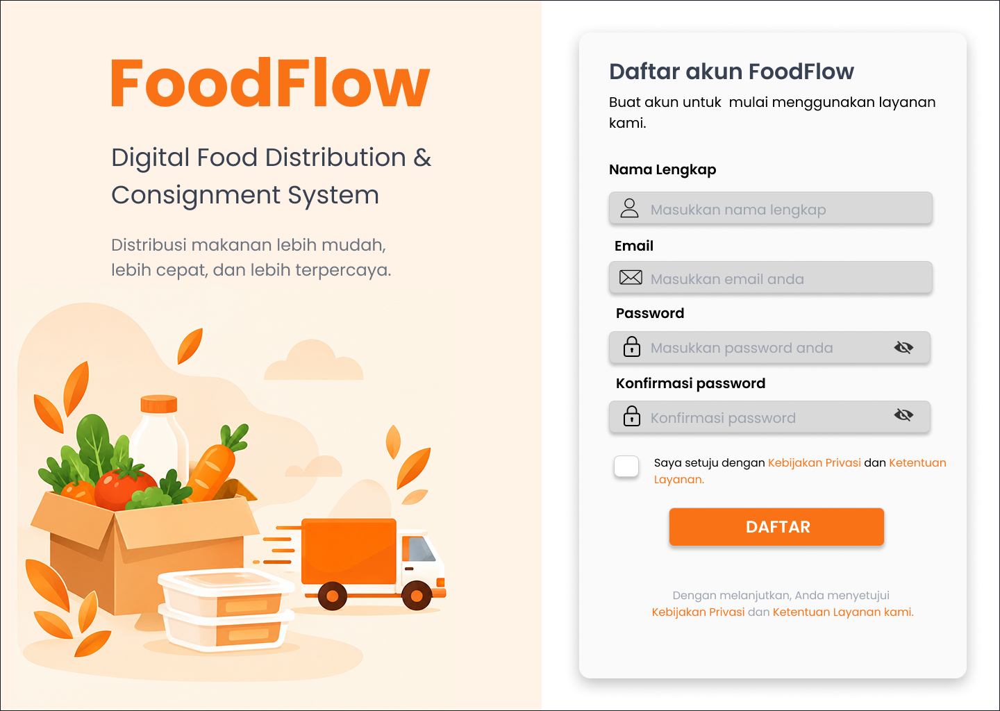
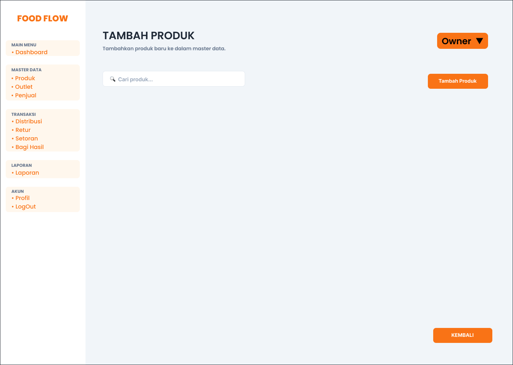
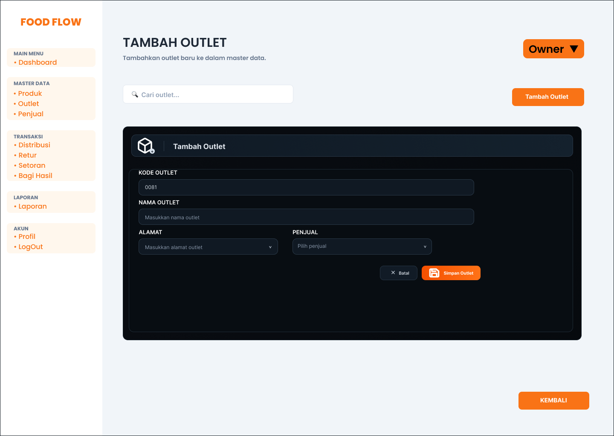

# Food Flow 🛒

> Aplikasi Desktop Manajemen Penjualan Sistem Konsinyasi untuk UMKM Kuliner.

## 📖 Tentang Projek
Food Flow adalah sistem informasi berbasis *desktop* yang dirancang untuk mempermudah UMKM kuliner dalam mengelola alur bisnis konsinyasi (titip jual). Aplikasi ini membantu pemilik usaha dalam melacak pergerakan stok barang, memantau performa penjualan tiap *outlet*, dan mengelola pencatatan data secara terpusat dan efisien.

## ✨ Fitur Utama
* **Dashboard Owner:** Visualisasi data ringkas dan grafik performa penjualan bisnis.
* **Manajemen Logistik:** Pelacakan distribusi stok produk antar *outlet* dan pencatatan retur barang.
* **Master Data:** Modul pengelolaan (CRUD) untuk data Penjual, Outlet, dan Produk.
* **Sistem Autentikasi:** Keamanan akses pengguna (Login & Registrasi) dengan manajemen hak akses.

## 🛠️ Teknologi yang Digunakan
* **Desain UI/UX:** Figma
* **Frontend:** Flutter (Desktop - Windows)
* **Database:** MySQL
* **Tools Lainnya:** Visual Studio Code, XAMPP / DBeaver

## 📸 Pratinjau Antarmuka (Screenshots)

| Dashboard | Manajemen Logistik |
| :---: | :---: |
|  |  |

| Master Data | Master Produk |
| :---: | :---: |
|  |  |

| Autentikasi (Login) | Autentikasi (Registrasi) |
| :---: | :---: |
|  |  |

| Tambah Produk | Tambah Outlet |
| :---: | :---: |
|  |  |

## 🚀 Cara Menjalankan Projek (Getting Started)

### Prasyarat
Pastikan sistem sudah terpasang perangkat lunak berikut:
1. [Flutter SDK](https://docs.flutter.dev/get-started/install) (versi terbaru dengan dukungan *desktop* Windows diaktifkan).
2. Server lokal MySQL (menggunakan XAMPP atau layanan sejenis).

### Langkah-langkah Instalasi
1. Kloning repositori ini:
   ```bash
  git clone https://github.com/sergiobennett/food-flow.git